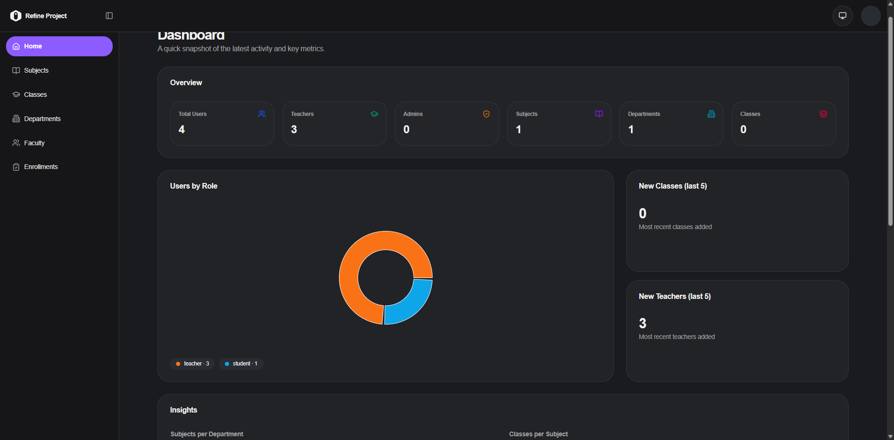

<div align="center">
  <br />
    <a href="https://youtu.be/ek7hmv5PVV8" target="_blank">
      
    </a>
  <br />

  <div>


 <br/>
 
 
 
 <br/>

 

 

  </div>

  <h3 align="center">Elimu Kuu - University Dashboard Management</h3>

</div>

## 📋 <a name="table">Table of Contents</a>

1. ✨ [Introduction](#introduction)
2. ⚙️ [Tech Stack](#tech-stack)
3. 🔋 [Features](#features)
4. 🤸 [Quick Start](#quick-start)

## <a name="introduction">✨ Introduction</a>

Elimu Kuu is a high-performance academic management hub built on the PERN stack. This multi-role system (Admin, Teacher, Student) features a decoupled architecture with an Express.js backend and a Refine-powered React frontend. Utilizing PostgreSQL (Neon) with Drizzle ORM, it ensures type-safe data integrity for class scheduling, departmental governance, and real-time institution analytics. Security and access control are handled via Better-Auth and Arcjet, providing a robust environment for modern campus operations.


## <a name="tech-stack">⚙️ Tech Stack</a>

### Frontend Stack

- **[React](https://react.dev/)** - Core UI library for building a responsive, component-based frontend experience.
- **[Refine](https://refine.dev/)** - Headless framework for building data-intensive admin panels and dashboards efficiently.
- **[shadcn/ui](https://ui.shadcn.com/)** - Accessible UI component library built with Radix UI and Tailwind CSS.
- **[Tailwind CSS](https://tailwindcss.com/)** - Utility-first CSS framework for rapid and maintainable styling.
- **[TypeScript](https://www.typescriptlang.org/)** - Static typing for enhanced code quality and developer experience.
- **[Zod](https://zod.dev/)** - Schema declaration and validation for runtime type safety.

### Backend Stack

- **[Express.js](https://expressjs.com/)** - Flexible Node.js framework for developing RESTful APIs.
- **[Drizzle ORM](https://orm.drizzle.team/)** - Lightweight, performant TypeScript ORM for seamless database operations.
- **[Neon](https://neon.tech/)** - Serverless PostgreSQL platform for scalable data storage.
- **[Better Auth](https://www.better-auth.com/)** - Comprehensive authentication framework for secure user management.
- **[Arcjet](https://arcjet.com/)** - Security primitives for rate limiting, bot protection, and sensitive data masking.
- **[Cloudinary](https://cloudinary.com/)** - Media management for automated profile image and banner hosting.
- **[Node.js](https://nodejs.org/)** - Scalable JavaScript runtime environment for backend logic.

### Dev Tools
- **[CodeRabbit](https://coderabbit.ai/)** - AI-powered code reviews for automated feedback on PRs.
- **[Site24x7](https://www.site24x7.com/)** - Full-stack monitoring for tracking performance and uptime.

## <a name="features">🔋 Features</a>

👉 **Multi-Role Authentication**: Secure entry system via **Better Auth** and **Arcjet** with dynamic routing for Students, Teachers, and Admins.

👉 **Unified Analytics Dashboard**: High-level institutional health overview with real-time stats on enrollment and faculty distribution.

👉 **Intelligent Subject Management**: Centralized curriculum control with instant filtering and detailed class assignment views.

👉 **Departmental Governance**: Structural management layer for organizing subjects, faculty, and students by academic branch.

👉 **Dynamic Faculty Directory**: Paginated professor directory with advanced search and profile image hosting via **Cloudinary**.

👉 **Advanced Class Orchestration**: Schedule sessions, set capacity limits, and manage complex teacher assignments using **Drizzle ORM**.

👉 **Code-Based Enrollment**: Secure student enrollment via unique joining codes, ensuring controlled access to academic materials.

## <a name="quick-start">🤸 Quick Start</a>

Follow these steps to set up the project locally.

**Prerequisites**

- [Git](https://git-scm.com/)
- [Node.js](https://nodejs.org/en)
- [npm](https://www.npmjs.com/)

**Cloning the Repository**

```bash
git clone https://github.com/your-repo/elimu-kuu.git
cd elimu-kuu
```

**Installation**

Install dependencies for both frontend and backend:

```bash
# Frontend
cd elimu-kuu
npm install

# Backend
cd ../elimu-kuu-backend
npm install
```

**Set Up Environment Variables**

Create `.env` files in both `elimu-kuu` and `elimu-kuu-backend` directories.

**Frontend (`elimu-kuu/.env`):**
```env
VITE_BACKEND_BASE_URL="http://localhost:5000/api"
VITE_CLOUDINARY_CLOUD_NAME=your_cloud_name
VITE_CLOUDINARY_UPLOAD_PRESET=your_preset
```

**Backend (`elimu-kuu-backend/.env`):**
```env
PORT=5000
DATABASE_URL=your_neon_db_url
BETTER_AUTH_SECRET=your_auth_secret
FRONTEND_URL="http://localhost:5173"
ARCJET_KEY=your_arcjet_key
```

**Running the Project**

```bash
# Start Backend
cd elimu-kuu-backend
npm run dev

# Start Frontend (in a new terminal)
cd elimu-kuu
npm run dev
```

Open [http://localhost:5173](http://localhost:5173) in your browser.
